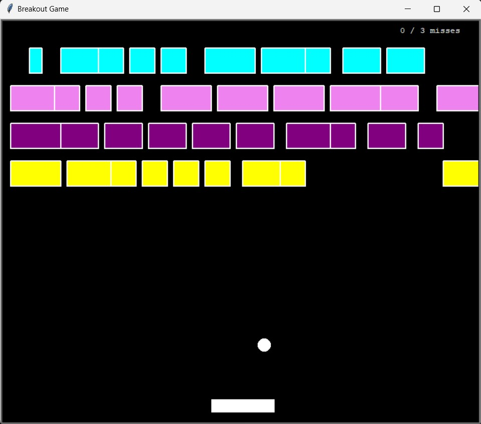

# Breakout Game with Turtle

A simple Breakout game implemented in Python using the Turtle graphics library. This game features a player-controlled paddle, a bouncing ball, and breakable walls.

## How to Play

1. Run the `main.py` script to start the game.
2. Control the paddle using the `a` (left) and `d` (right) keys.
3. Bounce the ball off the paddle to break the walls.
4. Score points by breaking the walls and avoiding the ball hitting the bottom wall.
5. The game ends when the ball hits the bottom wall three times.

## Files

- **main.py**: Main script to run the Breakout game.
- **player.py**: Class implementation for the player-controlled paddle.
- **scoreboard.py**: Class implementation for the scoreboard to track the player's score.
- **ball.py**: Class implementation for the bouncing ball.
- **wall.py**: Class implementation for the breakable walls.

## Dependencies

- Python 3
- Turtle graphics library (usually comes with Python)

## Gameplay

- The game window has a black background and measures 600x600 pixels.
- The player can move the paddle using the `a` (left) and `d` (right) keys.
- The ball bounces off the walls, paddle, and breakable walls.
- Score points by breaking the breakable walls.
- The game ends when the ball hits the bottom wall three times.

